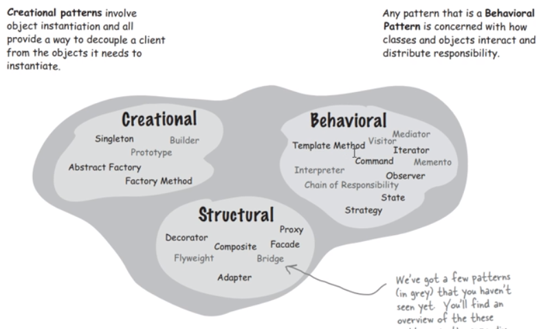
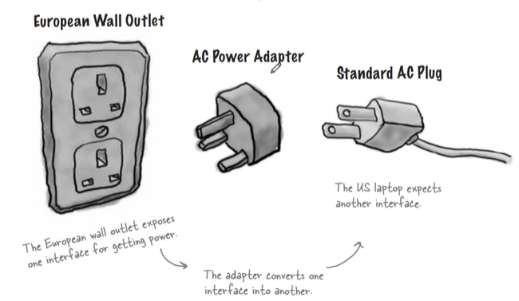

# designPattern
designPattern Study

# 중간 - 프로그래밍언어론

복습: No
유형: 전공
작성일시: 2021년 9월 3일 오후 6:21

## 1주차 21.09.01

본 강의에선 JAVA를 베이스로 강의할 것임.

---

### phases of software development

maintenance 유지보수

소프트웨어 개발

1. 요구 분석
2. 계획
3. 소프트웨어 디자인
4. 소프트웨어 개발
5. 테스팅
6. 구현

위 모든 것을 다루는 것이 소프트웨어공학임.

그 중에서 우리가 다룰 내용은 소프트웨어 설계 쪽

---

### Design Patterns

아키텍쳐를 디자인 패턴이라고 함.

1. Layered pattern : OSI 7 Layer
2. Client Server pattern
3. Master-slave pattern
4. Pipe-filter pattern
5. Broker pattern
6. Peer-to-peer pattern
7. Event-bus pattern
8. Model-view-controller pattern
9. Blackboard pattern
10. Interpreter pattern

---

### Design Patterns

- Creational Patterns : 전체 시스템에서 그 클래스에 해당하는 객체가 딱 하나만 존재해야한다? 이런 것을 만드는 것이 크리에이셔널 패턴
- Structural Patterns : 클래스 또는 객체들의 관계. 구조적으로 관계에 있을 때 명시하는 패턴
- Behavioral Patterns : 행위 패턴. 서로 커뮤니케이션할 때 행위적으로 어떻게 일어나는지?

---

### What is Gang of Four(GOF)?

이 세상에 존재하는 모든 응용프로그램을 디자인 패턴 3개 중 하나에 속하고, 그것들을 정형화할 수 있다.

그 기법만 알면 객체지향인 경우 이 세상에 모든 프로그램을 다 짤 수 있다.

모든 소프트웨어를 개발하는 사람들이 이 방법을 쓰도록 되어 있다.

프로그램은 20~30가지 정형화된 패턴 중에 하나이다. 이렇게 짜야 다른 사람이 이해할 수 있다.

---

### Pattern Categories

자바는 시스템 전체가 이런 패턴들로 이루어져있다.

자바 I/O는 데코레이더 형태로 되어 있다.

디자인 패턴을 공부하는 방법은 인터넷에 있는 Example들을 많이 봐서 체득하는 것이 좋다.

들어가기 전에 기본적인 개념을 알고 있어야 함.

---

### OOP Concepts

---

### What is an Object

오브젝트는 클래스의 인스턴스이다.

오브젝트는 변수이다.

클래스는 타입이다.

`int x` 에서 int는 Class, x는 Object에 해당된다.

---

### Examples of states and behaviors

절차적 언어 - 함수 중심

객체지향적 언어 - 클래스(객체) 중심

---

### Characteristics of Objects

객체의 큰 성질

1. Abstraction : 구체적 명시, 관련있는 데이터만 보여주고 불필요한 것들은 사용자로부터 가린다. Public / Private
2. Encapsulation : 캡슐화, 가지고 있는 데이터와  관련된 행위를 한꺼번에 모아둔 것.
3. Message passing : 여러 개의 객체가 존재하고 서로간의 인터렉트를 하게 된다.

---

### Object Oriented Programming features : 시험에 낼 수 있겠죠?

**Abstraction** : 관련있는 데이터만 보여주고 불필요한 것들은 사용자로부터 가린다. Public / Private

**Inheritance** : 부모로부터 물려 받은 데이터와 메소드를 더 확쟁해서 새로운 클래스를 정의한다. 결론은 코드의 재사용임.

- 부모클래스 : parent class, base class, super class
- 자식클래스 : sub class, child class

**Encapsulation** : 가지고 있는 데이터와  관련된 행위를 논리적으로 한꺼번에 모아둔 것.

**Polymorphism** : 다형성, 하나를 가지고 다양한 형태로 표현한다.

오버라이딩 : 이미 선언된 함수를 재정의하는 것.

오버로딩 : 여러 개의 함수를 같은 이름을 두고 사용하는 법.

C++에서는 이것을 Virtual Function이라고 부른다.

---

### Interfaces in Java

간단한 설명 : 여러 개의 메소드를 모아둔 것을 인터페이스라고 한다.

상수나 추상 메소드만을 가지고 있는 것을 말한다.

자바에서는 추상 메소드만 존재하는 것을 의미한다.

Teacher의 성질은 그대로 물려받고 Mathematician의 내용들은 전부 가지고 있어야 한다.

---

### UML

설계도를 그리는 수단이 필요하다.

클래스 다이어그램을 알 필요가 있다.

클래스를 명시할 때 다음과 같이 명시한다.

- op1 외부에서 호출 가능.
- op2 내부 메소드에서만 호출 가능.
- op3 자식에서만 호출할 수 있다.

---

### Relationship

1. Generalization(Inheritance)

부모 - 자식으로 구성되어있다.

부모가 인터페이스인 경우에는 점선으로 표시, 클래스인 경우 실선으로 표시!

1. Association
    
    A. Simple association : 관련 있는 클래스이다.
    
    
    
    B. Aggregation : 클래스와 여러 개의 클래스로 구성되어있다.
    
    
    
    C. Composition : Aggregation인데, 여러 개의 클래스를 갖는다. Class1이 없어지면 Class2도 없어진다. 소속관계라고 보면 됨.
    
    
    
    D. Dependency : 종속이다. 화살표인 점선임.
    
    
    
    클래스1은 클래스2에 따라 결과가 달라진다.
    

---

## 2주차 21.09.08

소프트웨어의 상세 설계부터 코딩하는 단계까지 필요한 기법을 **디자인 패턴**이라고 한다.

- 생성적 패턴(Creational)
- 구조적 패턴(Behavioral)
- 행동적 패턴(Structural)

---

### Strategy Patterns(전략적 패턴들)

오리가 등장하는 게임.

Class Diagram

- Super Class - Duck
- Sub Class - MallardDuck, RedheadDuck

---

소프트웨어는 끊임없이 진화한다. 소프트웨어의 확장.

모든 오리는 날 수 있도록 해달라.

fly() 를 정의하면 inherit 가능

코드의 재사용성 - reusability

---

모형 고무 오리도 넣어달라?

꽥꽥소리도 override 해야함.

display도 override 바꿔야함.

이렇게 되면 재사용성이 떨어진다.

---

DecoyDuck - 유인용 모형 오리

개발자와 유지보수 하는 사람이 다를 수도 있다.

점선으로 표시한 것은 Interface

실선은 클래스 상속 관계.

# 불변하는 부분/가변하는 부분으로 나눔.

- 불변하는 부분 : Swin
- 가변하는 부분 : quack, fly

공통적인 부분은 전부 물려 받게.

이렇게 하면 두가지 문제가 있을 수 있음.

1. 코드가 겹친다. 코드 중복이 일어난다. fly + quack
2. 

### 자바 인터페이스와 추상클래스

<aside>
💡 **Abstract class : 공통된 성질만 모아둔 것을 의미함**

</aside>

클래스 내에 abstract라고 붙는 것이 있으면 이것은 body가 없고, 그 아래 클래스에서 정의된다.

---

<aside>
💡 **Interface : 추상클래스와 비슷하지만 모든 추상 메소드를 구현해야하며, 생성자를 가질 수 없으며 객체화 시킬 수 없다.**

</aside>

- 상수 선언, 메소드 선언 밖에 없음.
- 메소드 바디 없음.

[upbreak05님의블로그 : 네이버 블로그](https://blog.naver.com/upbreak05/221283271858)

---

### 소프트웨어를 개발할 때는 변화에 대응하게 만들어야한다

변화에 잘 대응할 수 있도록 구성해야한다.

EX) 스마트폰 소프트웨어 업데이트 고려. Add On 되는 형식. 시스템 전체를 건드는 것이 아님.

- Object-Oriented Basics
    1. 추상화
    2. 캡슐화
    3. 다형성
    4. 상속성
- Object-Oriented Principles
    1. 변화하는 것은 캡슐화 해라.
    2. 상속보다는 합성어를 많이써라.
    3. 구현(Implementation)보다는 인터페이스를 프로그램 하라.
- Object-Oriented Patterns
    
    Strategy 패턴
    

### Design Principle

1. **어떤 응용이 있을 때, 그 응용에서 변하는 부분을 찾아내고, 항상 불변하는 거로부터 분리해내라.**

**이것을 따로 구별해서 하나로 모아라. → 이것이 Interface**

오리가 선택이 되면 Duck Behaviors 중에 가질 수 있도록. has a 관계

---

1. **인터페이스에 대해서는 프로그램하고 구현에 대해서는 프로그램 하지마라.**

**다형성** 

`Animal animal = new Dog()`

`animal.makeSound()`

### Interface : Animal

### Implementation(Concrete Object) : Dog, Cat

---

### 인터페이스를 다음과 같이 나눌 수 있다.

---

### 최종 구현 방법

---

## 3주차 21.09.14

### 저번 시간 복습

상속받는 클래스에서 변할 수 있는 부분은 Interface로 분리.

공통된 부분만 Super Class로 선언.

**Interface 사용할 경우 가변적인 부분을 분리한 것은 좋지만, 코드의 재사용성이 상당히 떨어진다.**

### Strategy Patterns

결국 이 그림으로 설명될 수 있다.

모든 Duck들이 다 상속이 된다. 상위 Duck과 하위 Duck은 is-a 관계

상위 Duck 클래스와 FlyBehavior, QuackBehavior는 has-a 관계  <<<< 여기는 가변적인 부분들

만약 새로운 오리를 추가해야한다면?

is-a 관계로 오리 클래스를 하나 추가.

Quack, Fly를 명시하면 다른 코드들은 손댈 필요 없다.

### Duck Class

`performFly()` , `performQuack()` 은 모두 자기가 하는 것이 has-a 관계에 있는 인터페이스에게 시킨다.

(Delegation : 위임)

위 값들은 하위 Class를 만들 때 생성자에 의해서 셋팅한 값에 의해 결정된다.

### HAS-A can be better than IS-A

상속은 반드시 좋은 것이 아니다.

### Design Principle

1. **Favor composition over inheritance.**

**구현 상속 보다는 인터페이스 상속을 사용한 객체 조합을 선호.**

**상속보다는 합성을 많이 사용해라.**

일부 가변적인 것들은 HAS-A 관계로 분리하는 것이 좋다. 이것을 Composition(합성) 이라고 부른다.

### 개발?

소프트웨어를 만들 때 유지 보수와 변화할 것을 생각해야함.

재사용만 해서 시간을 줄이는 것이 중요한게 아니라 유지 보수성이나 확장성에 더 노력을 해야한다.

상속은 전체 서브 클래스가 전부 영향을 받는다. 그것보단 변화할 수 있는 부분은 분리하는 것이 좋다.

# 이것이 Strategy Pattern

---

# Observer Pattern(관찰자 패턴)

Subject는 이벤트를 알려주는 것. Observer와 상반되는 개념.

윈도우즈에서 처리하는 방식 중 가장 많이 쓰는 방법 : Event driven 사건을 처리하는 것.

 

습도 기온 기압 데이터 → 기상청 → 날씨 데이터 오브젝트 → 디바이스

(우리가 작성해야할 것은 날씨 데이터 오브젝트임)

날씨 데이터 오브젝트는 기상청으로부터 데이터를 PULL한다.

Subject : 날씨 데이터 오브젝트

Observer : 디스플레이 디바이스

---

`measurementsChanged()` : 측정값이 바꼈을 때 디스플레이 장치에 화면을 바꿔주어야 함.

위 코드의 문제점은 장치가 추가되거나 변경되면 코드를 바꿔줘야 함.

### Observer Pattern의 핵심

디스플레이 장치가 늘거나 줄어도 `measurementsChanged()` 의 코드가 변경이 없도록 해야한다.

이것이 옵저버 패턴의 핵심

**EX) 신문 구독 매커니즘**

1. **신문사에서 신문을 만듦.**
2. **필요한 사람은 구독 가입을 함.**
3. **필요 없다면 구독 취소를 할 수 있다.**

### Publishers + Subscribers = Observer Pattern

## 4주차 21.09.22

Observer Pattern

WeatherDataObject 프로그래밍

이 3가지는 업데이트 해주는 코드

- currentCondtions~~
- statisticsDisplay~~
- forecastDisplay~~

이렇게 하게 되면 결과는 나오지만, 문제점이 있을 수도 있다.

**그렇기 때문에 Subject와 Observer로 분리를 해서 설계.**

**Subject에 변화가 생기면 Observer에서 Notify 할 수 있도록.**

### Publishers(Subject) + Subscribers(Observer) = Observer Pattern

### The Observer Pattern는 one-to-many dependency 이다.

**Subject에서 어떤 변화가 생겼을 때 종속되어있는 모든 객체에게 알려준다.**

### Observer Pattern Class diagram

왼쪽 Subject WeatherData / 오른쪽은 Display

### 우리 책의 예시를 적용하면 코드

- 서브젝트(웨더데이터)는 옵저버 등록, 삭제, 알림을 갖고 있어여하며 각 정보를 get하는 메소드 포함해야한다.
- 옵저버(디스플레이)는 업데이트 메소드를 상속받아야한다.

### 인터페이스 기본 틀

### WeatherData 구현

Subject의 내용들을 포함

- registerObserver : 옵저버의 정보를 ArrayList에다가 저장한다.
- removeObserver : 해당 옵저버의 정보를 ArrayList에서 삭제한다.
- notifyObserver : 각각의 업데이트 메소드가 호출될 것임.

디스플레이 장치가 변한다고 해도, measurementsChanged 는 변하지 않는다. 이런 장점이 있다.

### Display

옵저버를 구현함.

**생성자에 Subject를 받아서**

- Subject 정보 변수에 저장.
- registerObserver 함수 호출.

### Main 예시

setMeasurements 하면 observer 내에 있는 것들 모두 update

### weatherData.java

책의 코드와 다른 점은 템플릿을 사용했다. 향상된 for문 사용했다.

### 만약 ThirdPartyDisplay를 추가하고 싶다면?

이렇게 클래스 정의하면 됨.

### The power of Loose Coupling

객체와 객체의 관계가 루즈하게 묶여있는 것.

객체와 객체나 클래스와 클래스의 관계는 루즈하게 묶여있는 것이 좋다.

아까 코드처럼 삭제나 추가를 했을 때 의존성이 없다면 루즈한 관계임!

### 추가설명 : 참고

Observer에 해당하는 것 : ActionListener

update()에 해당하는 것 : actionPerformed()

한쪽에서 이벤트를 발생하고 이벤트를 처리한다면

Subject와 Observer로 처리한다.

---

### 자바에선 Subject에 해당하는 것을 Observable이라고 표현

차이점은 아까는 인터페이스였는데 여기선 클래스로 정의.

클래스로 정의하면 장점.

- implements가 아니라 extends라서 코드가 짧아짐.
- register, remove, add 기능들이 built-in으로 이미 클래스에 구현이 되어있기 때문에 효율적.

 

**자바 버전이 9로 오면서 Observable이 사라졌다**

왜냐하면 Observable을 상속받는 순간 다른 곳에서 상속 받지 못해서.

자바의 특징이 Single  Inheritance이기 때문에.

## 원칙 정리

1. Loosely Coupled로 구성하라 (Observer 패턴으로 구성하라)
2. 옵저버 패턴인 경우에 한쪽은 사건을 발생시키고 한쪽은 사건에 대한 처리를 하라. 그 외의 종속관계를 줄여라.

### 3장 내용 미리 설명 Decorating Objects

오프젝트 장식

원래의 기능이 있는데, 그것에 대해서 새롭게 만든다기보다는 필터를 덧씌워서 기능을 추가하는 것.

자바 I/O가 데코레이터 패턴의 전형적인 예시

뜻 : 파일 인풋스트림을 읽어들이고, 그것을 버퍼로 읽어들이고 다시 LowerCase(소문자)로 바꿔라 그것을 인풋스트림 변수에 최종적으로 저장해라.

### 핵심은 원래 기능에 씌우는 것.

### 커피 만들기 예시

이렇게 해도 문제가 됨. flavor에 따라서 메소드를 매번 만들어줘야함.

좋은 설계는 다음과 같이 해야함.

Coffee 종류와 Flavor 종류를 분리.

Beverage와 CondimentDecorator는 has-a 관계이다. 왜냐하면 Milk와 Mocha 이런 클래스에 Beverage 변수가 존재하기 때문에.

자바의 I/O 가 위 데코레이터 패턴을 많이 쓴다.

## 5주차 21.09.29

### 데코레이터 패턴 : 어떤 동적인(런타임 떄) 오브젝트에게 추가적인 역할을 부여할 때 쓰는게 데코레이터 패턴이다.

### 안좋은 예시

이렇게 짜면 안된다.

- 기본적인 원칙이 상속관계인데, 상위 클래스가 바뀌면 안되기 때문에.
- is-a 관계는 불변하는 것이 좋음.
- 어떤 첨가물이 있는지 다 기억해야한다
- 종류가 변하면 코드도 바뀌어야 해서 매우 비효율적이다.

### The Open-Closed Principle(OCP)

프로그램을 짤 때 기본적인 전략

클래스가 extension에 대해서는 열려있어야 하고, modification에 대해서는 닫혀있어야 한다.

**(변경은 가능한 하지말고, 추가확장을 선호하라)**

**변경 지양** - 기존 클래스에 변수를 추가하거나 메소드를 추가하는 행위를 하지말라.

**새로운 추가 확장** - 

첨가물에 대한 

여기서 핵심은 각 첨가물은 `Beverage beverage` 를 갖는다.

- 검은 화살표는 has-a 관계
- 흰 화살표는 is-a 관계

이러한 첨가물 포함관계로 나타내타다가 음료가 나오게 되면 끝이난다.

**이것이 실제로 Recursive 한 관계임**

장점은 새로운 첨가물이 추가될 때 새로운 클래스를 추가만 하면 된다.

DarkRoast 가격을 계산해야한다면?

그냥 계산하면 됨.

DarkRoast에 모카가 추가된 가격을 계산한다면?

모카가 3원이라면?

모카 3 + 다크로스트가격 하면 됨.

DarkRoast에 모카 + 휘핑이 추가된 가격을 계산한다면?

가격 계산하는 것.

### 전체적으로

이러한 구조를 지닌다.

ConcreteComponet와 ConcreteDecorator의 차이는 인스턴스 변수를 가지고 있다.

### Decorator 예제 코드

### Beverage.java

추상 메소드 cost()

### DarkRoast.java

상속받은 description 변수에 String 값 들어감.

cost 값 return 가격 return 해 줌.

### Milk.java

beverage에 대한 cost 더하기 첨가물에 대한 cost

### Main.java

### 만약 Salt를 추가한다면!?

새로운 첨가물이 추가되더라도, 다른 코드를 변경하지 않음.

### 자바에서 데코레이터 패턴 I/O

### LowerCaseInputStream을 만든다면?

### BULLET POINTS

- 상속을 통해 하게 되면 확장은 할 수 있지만, 융통성은 떨어진다.
- 새로운 기능이 필요하면 그것을 확장을 해야하지, 기존의 코드를 변경하면 안된다.
- 합성(Composition : has-a 관계)과 위임(Delegation : 남에게 미룬다)은 런타임에 기능을 추가하기 좋다.

### 패턴의 종류를 크게 구분하면 3가지 종류

1. Structural(구조)
2. Behavioral(행위)
3. Creational(생성)

오늘부터는 생성에 관련된 패턴을 공부함.

기존과 같이 프로그램을 짰을 때 어떤 문제가 있고, 왜 패턴을 사용해야하는지?

피자 type이 어떤 건지에 따라서

근데 예를 들어 피자 종류가 추가되면 else if 문을 계속해서 추가해줘야함.

이렇게 되면 코드를 계속 수정해줘야함.

**Open-Closed Principle에 위배된다.**

### Factory Patterns

[디자인패턴 - 팩토리 패턴 (factory pattern)](https://jusungpark.tistory.com/14)

별도에 Class에 CreatePizza

### Factory 구현 방법

- Factory Class를 구현하는 방법
- Factory Method를 구현하는 방법

### Factory Class

피자스토어를 만들 때 피자팩토리를 인자로 받음.

**이렇게 되면 피자 종류가 바뀌어도 피자스토어 코드가 바뀔 일이 없음!**

공장을 다르게 지정할 수도 있음. 

### Pizza 예시 코드

### Factory Method

PizzaStore에 createPizaa를 추상클래스로 정의함.

팩토리 메소드에 의한 방법

## 6주차 21.10.06

### Factory Patterns

- Factory Class
- Factory Method

`List l = new ArrayList();` 이렇게 쓰는 이유?

나중에 구현이 바뀌더라도 대체가 가능함. ArrayList에서 LinkedList로 대체 가능.

List는 abstract, interface라고 이야기 하고,

ArrayList는 implementation, concrete class 라고 이야기 함.

---

### Factory Class

피자 가게를 열었다고 가정하면, 피자에 필요한 소프트웨어를 작성해야 한다.

1. 피자 스토어를 만들어야 함.
2. 피자 스토어 안에는 orderPizza()라는 것이 필요.
3. 치즈피자인지, 그릭피자인지, 페페로니 피자인지 구분
4. 이후 준비하고, 굽고, 자르고, 포장하고, return pizza;

이렇게 프로그램을 만들면 문제점이 발생한다. 나중에 피자의 종류가 바뀌면 else if 로 피자 타입을 또 추가해주어야 함.

**프로그램이 피자의 종류가 바뀔 때마다 매번 수정해줘야함.**

그래서 FactoryClass를 만들어 피자를 생성해주는 전용 클래스를 만들겠다.

### 피자 만들기 프로세스

1. PizzaStore가 orderPizza()로 주문함.
2. SimplePizzaFactory가 createPizza().
3. Pizza 클래스에서 종류 선택.

### SimplePizzaFactory

피자를 만들기 위한 전용 메소드 하나밖에 없다.

팩토리를 하나 만들고 피자스토어 생성자에 팩토리를 지정.

orderPizza 내에서 createPizza

### Factory Method

피자 가게가 2개가 있음. 둘은 피자를 만드는 방법이 다름.

- 뉴옥 스타일
- 시카고 스타일

서로 스타일이 다름.

### Factory Method 예시

### PizzaStore

### ChicagoPizzaStore

1. 인자를 받아서 orderPizza 를 한다.
2. 해당 인자를 받아서 createPizza를 한다. 각 피자 클래스 생성.

이처럼 다형성에 의해서

1. ChicagoStore나 NYStore는 자기 자신이 orderPizza가 없으므로 Super Class를 참조하게 됨.
2. 해당 orderPizza 내에 createPizza가 있는데 자기 자신이 갖고 있지 않으므로 상속받는 하위 클래스에서 createPizza를 호출함.
3. createPizza는 다형성에 의해서 만든 것이므로 **Factory Method** 라고 말함.

# 중요!!!

만약 서울 스타일이라면 SeoulStylePizzaStore 만들면 됨. 새로운 것을 추가할 때 기존 프로그램에 영향을 주지 않음.

**OCP : 확장에는 열려있고 변경에는 닫혀있다.**

### The Factory Method Pattern

목적은 오브젝트를 생성하는 인터페이스를 정의하는데 쓴다.

클래스가 그 클래스에 해당하는 객체를 만드는 결정을 서브클래스에게 맡긴다. `createPizza()`

factoryMethod() 상위 클래스에 있고, 실제로 생성하는 것은 하위 클래스에서 생성됨.

### DependentPizzaStore  지금 같이 안 짰다면

이렇게 짜게 되면 유지보수가 되게 어려움.

Y에 변화가 생기면 X도 변경이 일어나야 한다.

화살표가 올라감.

PizzaStore는 Pizza에게만 Depend함.

(Pizza에 변화 있다면 PizzaStore도 변함.)

CheesePizza는 Pizza에게만 Depend함.

(CheesePizza 변화있다고 Pizza 변화 x, Pizza 변화 있다면 CheesePizza 변함)

Pizza가 SuperClass, NYCheesePizza extend 관계.

피자 종류들은 implementation class 들.

하지만 전자는 피자 종류가 바뀔 때마다 PizzaStore가 영향을 받음.

### The Dependency Inversion Principle

의존 관계를 뒤집었다는 것.

Pizza에 의존하지 NYCheesePizza에 의존하지 말아라.

program to interface not to implementation.

인터페이스에 대해 프로그램하고, 구현에 대해 프로그램 하지 마라.

---

### Abstract Factory Pattern

팩토리를 만드는 팩토리.

피자 재료 팩토리 인터페이스로 만들기.

재료들을 가지각색으로 만들어 줌.

하지만 공장에서는 Dough 자체로 봐야한다.

Dough, Sauce, Pepperoni 등등은 전부 인터페이스로 되어 있어야 한다.

공장마다 생성하는 것이 다름. 이것이 팩토리를 만드는 팩토리.

### 전체적인 플로우

Client는 저것들만 봄.

### Depend on abstactions, Do not depend on concrete classes.

---

다음 시간에는 Singleton Pattern

## 7주차 21.10.13

### 생성패턴

- factory
- abstract factory

### Singleton 싱글톤

해당 클래스에 해당하는 객체는 하나만 만들어지게끔.

EX)

- 스케쥴러 클래스 : 시스템에 하나만 존재
- 프린트 클래스 : 프린트 클래스 하나.

시스템에 관련된 리소스는 

생성자를 private로 지정하는 법.

이렇게 쓰게 되면 `MyClass m = new MyClass();` 못함. 하지만 이렇게 되면 생성 자체를 못함.

그래서 `getInstance()`를 static으로 선언.

이렇게 하면 생성자는 private이고, `getInstance()`에서 클래스 리턴.

그런데 여전히 문제가 있음. MyClass형으로 따로따로 존재하기 때문에.

**only ONE Instance가 아님.**

그래서 어떻게 해야하는가?

클래스 변수를 하나 두고

- null일 때만 새로 할당
- null이 아니라면 해당 클래스 변수 자체를 리턴

`m = Singleton.getInstance();`

`n = Singleton.getinstance();`

둘은 똑같은 인스턴스를 받음.

### 싱글톤 패턴

어떤 클래스에서 오직 하나의 인스턴스(오브젝트)만 갖는다, 어떤 클래스에 new를 할 수 없고 하나의 객체만 갖어야 한다.

static을 쓰는 이유는 객체를 만들지 않고도 함수를 호출할 수 있기 때문입니다.

static 키워드를 붙이면 메모리에 딱 한번 할당해주기 때문.

static 변수는 서로 다르지만 공통된 객체의 인스턴스를 호출할 때, 인스턴스가 공유하는 기준 값을 제공해주는 역할을 함.

**자바에서 나오는 getInstance는 무조건 싱클톤 패턴이다.**

---

### 멀티 쓰레딩

크리티컬 섹션이 생기게 되면 문제가 된다.

n과 m에서 서로 다른 new Sinlgeton()이 생성될 수 있다.

`**synchronized` 키워드를 붙이면 lock을 해줘서 그런 문제를 방지할 수 있다.**

**이것을 threadSafe라고 함.**

### double-checked locking

기다리는 시간을 줄이는 것. 문제가 되는 부분만 synchronized

문제가 되는 부분만 처리함. 밖에서 기다리는 것보다 위 같이 안에서 기다리는 것이 시간적으로 효율적.

double checked 라고 하는 이유는 `==null` 을 두번 체킹하기 때문

### Command Pattern

이런 식으로 프로그램을 짠다면 어떤 문제가 있을까?

이렇게 짜면 기계를 바꾸거나 하면 코드 자체를 건들여야하는 문제가 발생.

이런식으로 구성하지 않겠다.

Clinet : 버튼을 누르는 사람

Invoker : Remote Controlloer

Receiver : Fan, Light

### Set하는 것과 Execute하는 것이 전부 Command

1. 클라이언트가 버튼을 누름.
2. 리모컨은 해당 Command를 execute.
3. 실제로는 Receiver가 실행하는 것. EX) fan.on(), fan.off(), light.on(), light.off() 이것을 전부 Command로 보이게

### Command 인터페이스

### Command 인터페이스 상속

### RemoteControl

버튼을 눌렀을 때 어떤 커맨드를 줄것이냐 → setCommand() 메소드

버튼을 눌렀을 때 실행 → slot.execute()

### 메인 함수

1. 리모컨 객체를 하나 만듦.
2. Light를 하나 만들고, 그것을 LightOnCommand에 등록
3. `remote.setCommand(lightOn);` lightOn 객체를 remote에 setCommand 함.
4. 그리고 buttonWasPressed를 누름. 

slot.execute() → LightOnCommand의 execute() 실행 → Light의 On 메소드 실행

Remote 안에 Command 존재.

LightOnCommand의 execute인 light.on 실행

이런 느낌

### The Command Pattern

encapsulate a request

외부에서 보면 그냥 커맨드라고 보임. 한번에 객체로 묶어버린 것이다. 모두 다 커맨드로 보임.

리케스트를 오브젝트화 한다. 이런 커맨드를 하나로 묶어버린다.

### 이런식으로 on/off 두 개의 커맨드를 받게 되어있다면?

- NoCommand는 Initialize 느낌.

- setCommand에 slot을 주고, 해당 slot에 맞게 onCommand, offCommand 설정
- 버튼 눌렀을 때 해당 slot에 해당하는 execute 실행

### 메인 함수

## 이렇게 구성하면 새로운 전자기기가 들어온다해도 Remote Controller의 코드는 바뀌지 않음. set만 다시 해주면 됨.

### 좀 전에 했던 것을 다시 되돌리는 undo();

undo() 했을 때는 반대로 하면 됨. 이전 버튼이 어떤 것이었는지 기억해야할 필요성이 있음. 아니면 반대 기능을 하거나.

조금 전에 실행했던 명령어

### 매크로(Macro Execution)

a set of commands

커맨드 패턴을 쓰면 매크로의 기능도 할 수 있다.

매크로 커맨드 하면 모든 것을 on하거나 off 할 수 있다.

### 명령이 한번에 들어온다면?

명령어에 들어가야하는 형태가 Command 타입이 되어야 한다.

Job Queue 같은데서도 굉장히 자주 쓰인다.

### 로그 사항 요청

logging requests

어떤 명령어를 실행했는지 저장하고 있어야 하니까 커맨드 패턴을 쓰면 편하다.

---

[각 패턴들 정리](https://www.notion.so/689c0e562c0d4262b3e0e3979cf35d5d)

# 기말 - 프로그래밍언어론

복습: No
작성일시: 2021년 10월 25일 오후 12:18

## 8주차 21.10.20

### Adapter Patterns

서로 다른 규격을 연결하기 위해 Adapter를 사용한다.

기존에 있는 코드를 구입한 S/W에 맞게 변경.

No Changes, Just Extension

### TurkeyAdapter

quack을 호출하라고 하지만 이것을 turkey.gobble 호출로 대신 함.

### 전체 코드

### WildTurkey

### Turkey

### Adapter Pattern

한 클래스의 인터페이스(터키 인터페이스)를 클라이언트가 요구하는 다른 인터페이스(오리)로 바꿔주는 것.

개념은 굉장히 쉬운 개념인데 많이 사용함.

### 자바 말고 다른 언어에서 Adapter

Multi Inheritance로 두 개의 특성을 다 가지도록 하는 방법도 있음.

다중 상속은 가능하면 쓰지 않는 것이 좋다.

# 이 방법은 쓰지마세요.

### Enumeration 인터페이스

hasMoreElements()

nextElement()

oldCode를 NewProgram에서 갖다 쓸라고 한다.

이때 필요한 것이 Adapter

### Facade Pattern 퍼사드 패턴

만약 집에서 홈 시어터를 사용한다고 가정하면

집에서 팝콘 기계 작동

팝콘을 튀기고

조명을 낮추고

스크린을 낮추고 등등

이런 HomeThraterFacade를 클래스로 두고, 알아서 다루게 한다. 중앙 집중 제어를 해준다.

### Facade Pattern

Unified Interface를 제공한다. 단일화된 오브젝트로 서브시스템을 제어한다.

### The Principle of Least Knowledge

최소 지식 원칙

client → station(기상 관측소) → Thermometer(온도 측정기), 기압측정기, 온도측정기 등등

 밑은 principle을 지킨 상황

 1번은 맨 오른쪽이 변화되면 전부 변화함

2번은 맨 오른쪽이 변화하면 맨 왼쪽 변화줄 필요 없음.

Least Knowledge 내가 꼭 알아야 하는 것만 알아야 함.

건너 건너 호출하면 복잡해지니까 한 단계에 있는 friends 한테만 호출하겠다.

### How NOT to Win Friends and Influence Objects

immediately Friends

1. 메소드를 호출할 때 자기 자신을 호출하거나 - Car
2. 파라미터로 넘어온 메소드만 호출 하던지 - Key
3. 자기가 메소드 상에서 Local로 만든 객체 - Doors
4. 컴포넌트 has-a 관계에 있는 메소드만 호출 - Engine

---

## 9주차 21.10.27

### Template Method Pattern

1번 3번만 동일하고 2번 4번은 다르다.

공통되는 건 추상 클래스에 두고 개별적인 건 하위 클래스에서 정의

reusability 재사용성

이름을 통일된 이름으로 바꿔준다.

## **달라지는 건 abstract로 선언. 단 이름은 같아야  함**

**prepareRecipe는 템플릿 메소드**

슈퍼 클래스에서는 공통된 boilWater와 pourInCup 호출

하위에서는 달라지는 부분인 brew와 addCondiments만 호출

### Main함수

### The Template Method Pattern

어떤 메소드의 뼈대를 정의한다. 일부 Step(서로 다른 부분)은 서브 클래스에게 미룬다. 공통된 부분만 상위 클래스에서 정의한다.

---

Hooked on Template

선택적으로 메소드를 넣고 안 넣고를 갈고리처럼 걸어놨다는 의미로 표현

### The Hollywood Principle

헤드헌터가 하는 말. Don't call us, we'll call you.

**필요에 따라서 상위 클래스가 하위 클래스를 호출함.**

**하위 클래스가 상위 클래스를 호출하진 않음.**

### Sorting with Template Method

템플릿 메소드 

클래스 이름이 s로 끝나면 그 안에 있는 유틸리티들을 모아놓은 것이다.

Sort가 Template Function이 되고 비교하는 대상을 어떻게 해야하냐 name, age

sort 파라미터 object 형태로 받음.

Comparable<Person>을 통해서 compareTo 메소드를 사용해야한다.

오리의 이름으로 소팅할 건지 무게로 소팅할 것인지.

ascending 오름차순으로 정렬

현재 무게가 더 작다면 -1

같다면 0

현재 무게가 더 크다면 1

원하는 대로 비교하려면 compareTo를 재정의 해야함

sort(Object[] a)에서 a는 반드시 Compareable을 implements 하고 있어야 한다.

Comparator<T>는 compare 메소드를 갖고 있음.

### Comparator - compare 메소드

## 10주차 21.11.03

### Iterator Pattern

반복적인 데이터의 순차적인 엑세스 (반대 개념으로 랜덤 엑세스)

데이터를 처음부터 어세스 할 때 프로그램을 어떻게 짜야하는가?

아침이랑 저녁 파는 메뉴가 다르다.

이 두개를 통합해서 통합 메뉴를 만들고 싶다.

### MenuItem

메뉴 아이템 클래스는 하나하나를 담는 클래스

### 아침 메뉴 - PancakeHouseMenu

### 저녁 메뉴 - DinnerMenu

## Array VS ArrayList

Array : 고정적 크기, 중간에 꺼 삭제하면 그 이후 데이터 앞으로 밀어야 함.

ArrayList : add할 때마다 길이가 가변적으로 증가.

배열의 크기 넘어가면 안돼서 if numberOfItems ≥ MAX_ITEMS 해줌.

### 두 메뉴들을 통합한다면??

ArrayList의 길이는 가변적이기 때문에 size()

배열의 길이는 고정적이기 때문에 .length

이렇게 하면 문제가 되는 것이 메뉴가 바뀌면 통합메뉴가 바뀌지 않음.

ArrayList를 Array로 바꾼다면 통합메뉴 코드도 바꿔줘야 함.

통합된 interface.

### List VS Set

List는 중복이 되고, Set은 중복이 되지 않는다.

파란색은 인터페이스임.

### Map

Key-Value 형태로 구성

Key 순서대로 Sorted 되어있는 것이 SortedMap

Collection에 해당되면 Set이나 List에도 속함.

### ListIterator 예제

listiterator는 다음요소를 가지고 있는지 이전요소를 가지고 있는지도 알 수 있음.

### 아침은 ArrayList 저녁은 Array로 되어 있는데 이것을 일괄되게 전부 Print 하고 싶다

두개의 for loop를 고려하는 것은 바람직하지 않다.

ArrayList도 Iterator를 둬서 순차적으로 엑세스할 수 있도록 한다.

Array도 Iterator를 사용해서 순차적 접근이 가능하도록 한다.

Iterator를 built-in을 쓰지 않고 직접 만들겠다.

### Array인 Diner의 next(), hasNext

### ArrayList인 Breakfast next(), hasNext()

### Waiteress

## 11주차 21.11.10

### Iterator 패턴 복습

하나는 ArrayList, 하나는 Array 이렇게 구성되어있음.

Array인지 ArrayList인지 고려해야함.

그래서 다음 요소가 있는지 물어보는 건 hasNext

다음 요소를 가져오는 건 next

데이터 엑세스는 Waitress를 통해서 한다.

### 자바 내의 Iterator를 쓰려면

remove도 구현해야한다.

### Iterator Pattern

데이터의 모임을 안에가 Array로 되어 있던 ArrayList로 되어있던 LinkedList로 되어있던 내부 구조에 관계 없이 hasNext와 next로 순차적으로 가져와서 접을을 제공한다.

ConcreteAggregate를 직접 접근하는 것이 아닌 Iterator를 통해서 접근

---

### OO principle

## Single Responsibility

단일 역할

하나의 클래스가 여러가지 역할을 하게 되면 dependency가 높아짐.

순차적인 Access 역할만 하는 Iterator를 둠으로써 Single Responsibility.

순차적인 부분이 바뀌면 순차적인 클래스만 바뀌면 된다!

EX)

역할1, 역할2, 역할3 이것을 한번에 가지고 있는 거보다 클래스 별로 나누는 것이,

프로그램 유지보수 측면에서 효율적이다.

low cohesion : 관계 없는 함수를 한번에 가지고 있는 것.

high cohesion : 연관된 함수를 가지고 있는 것.

시퀀셜한 엑세스를 하기 위한

---

## Composite Pattern

 

카페 메뉴를 추가할 것인데 이는, 해쉬테이블로 되어있음.

해쉬테이블은 Key-Value 쌍으로 되어있음.

createIterator로 값을 가져옴.

---

해쉬테이블은 옛날 자료구조임 요새는 전부 HashMap을 씀

### 자바 컬렉션

컬렉션 ⇒ 데이터 모임

built-in된 것의 최상위 클래스가 컬렉션임.

Iterator를 따로 만들 필요 없이 ArrayList.Iterator 하면 된다.

하지만 배열은 자체 Iterator를 제공하지 않아서 따로 만들어야한다.

Collection.values() : 값에 대한 것들만 쭉 가져오는데 배열을 만든다.

**해쉬의 특성 떄문에 순서가 보장되진 않는다.**

keySet 메소드의 반환형이 Set이고, Set은 콜렉션이기 때문에 이터레이더 사용 가능.

ArrayList로 되어있던

HashMap으로 되어있던

Array로 되어있던

모두 동일한 방법으로 print 할 수 있는 장점이 있음.

---

## Composite Pattern

Recursive 한 자료구조에서 사용되는 패턴

여기 있는 것을 모두 Print 하고 싶다면?

루트와 3개의 트리로 나뉘어진다.

모든 리프노드를 Print 하고 싶을 때 어떻게 코드를 짜겠는가?

리프 노드를 출력하려면 다음과 구조가 필요하다

MenuItem과 Menu의 공통요소를 SuperClass로 정의한다.

## 중요한 것! Menu에 인스턴스 변수 MenuComponent가 있음.

has-a 관계

Menu는 MenuItem과 MenuComponent를 포함할 수 있다.

트리의 리프 노드는 Menu와 MenuItem 둘 다 될 수 있다.

MenuComponent여야지 자식이 Menu든 MenuItem이든 될 수 있기에 인스턴스 변수로 설정되어 있음.

Child 관련 메소드

- add
- remove
- getChild

---

### Composite Pattern

Part-Whole 계층 구조를 가지고 있는 오브젝트를 다룰 때 사용

### MenuComponent

### Menu

Child 를 어딘가에 보관해야하기 때문에 ArrayList 형태

Print 로직

- 자기 자신 getName getDescription 호출
- ArrayList(자식)이 존재한다면 iterator를 통해서 print

### Main

allMenu 아래에

- pancake
- diner
- cafe

add 될 때마다 리프 하나씩 추가됨.

### Waitress

---

## Composite Iterator는 나중에 진도를 다 나가고 말씀드릴게요

이것들의 관계는 part-whole(부분-전체)의 관계이다.

컴포넌트가 UI의 최상위 클래스

Recursive Composition

## 12주차 21.11.17

### State Pattern

state transition diagram

### Gumball Machine

각 메소드에서 state에 따라서 처리함.

insertQuarter()

ejectQuarter()

경품 당첨 상태인 Winner를 하나 더 두고 Winner일 시에 2개가 나오도록 하고싶다.

그렇게 되면 WINNER에 대한 모든 else if 문을 하나 생성해줘야함 비효율적임.

### 해결법 : 상태(State)를 코드화 하지말고 클래스화 한다.

State를 Interface로 선언하고 이것을 implements 하도록 한다.

이렇게 되면 새로운 상태가 추가될 때 그냥 state를 implements 해서 새로운 state를 만들면 된다.

State 클래스 별로 State Interface가 가지고 있는 메소드만 구현해주면 됨.

gumball machine의 상태 변화는 setState 메소드로 바꾸면 된다.

생성자로 현재 gumball machine에 대한 정보 입력.

### GumballMachine 클래스

State로 상태를 갖고 있음.

State로 state를 가지고 있음. << 현재 state를 의미.

생성자에서는 각각의 state를 생성해주면서 gumballmachine 자기 자신을 등록.

count는 gumball의 갯수

### The State Pattern

어떤 오브젝트가 내부 상태가 변화했을 때 그것에 따라 취하는 행동도 변화할 수 있게 만든 패턴.

### 다음 시간에는 winnerState가 추가됐을 때 어떻게 해야하는지 배움.

## 13주차 21.11.24

### Proxy Pattern

(distributed object : 분산 객체)에 대한 이론적인 베이스가 되는 것.

객체1과 객체2의 매개 역할을 하는 것을 Proxy라고 함.

검볼머신과 검볼클래스가 있다.

검볼모니터에서 검볼머신에 대해 호출. get메소드

1. 검볼머신 하나 만들고
2. 검볼모니터 만들면서 만든 검볼머신 등록
3. `monitor.report();` 

자바에서 다른 컴퓨터에 있는 메소드는 호출할 수 없다.

**로컬 메소드가 아니기에 중간에 무언가가 있어야 하는데 이것을 가능하게 해주는 것이 Proxy**

Proxy를 통해서 Gumball Machine의 메소드 호출

실제로는 helper(Proxy)가 양단에 존재해야한다.

클라이언트 헬퍼는 정보를 넘기기 위해서 packages up(marshall)

서비스 헬퍼는 정보를 받기 위해서 unpacks(unmarshall)

실제로 호출하는 건 Client Object가 Client Helper한테 호출하는 거 밖에 없음.

### Java RMI(Remote Method Invocation) 원격 메소드 호출

- RMI Compiler 제공

자바에서 RMI Compiler에 의해서 자동으로 생성된다.

- **RMI STUB == Client Helper**
- **RMI SKELETON == Service Helper**

맨 처음 해야할 일은 Service Object를 RMI Compiler를 돌려서

RMI STUB과 RMI SKELETON을 만들어야 한다.

### 자바 RMI 컴파일러로 RMI 만드는 법

1. 외부에 공개되는 메소드를 인터페이스로 정의해야함.
2. 원격 Implementation
3. RMI 컴파일러에 의해 STUB과 SKELETON 만듦.
4. RMI Registry를 돌린다.
5. remote 서비스를 실행.

1. 원격이기 때문에 UnicastRemoteObject 한거다. 라고 이해하세요.
2. 

 

1. Service 객체 생성
2. RMI Compiler
3. STUB를 서버단에서 RMI Registry 등록

### Remote Service 코드

service rebind한다.

이것들 전부 따로 따로 등록된다.

sayHello를 호출하면 RMI Registry에 등록된 STUB을 찾아서 다운한다음 연결.

**이것은 뒤에서 일어나는 일**

**우리 눈에 보이는 것은 원격 호출인데 Local 호출인 것처럼.**

 

### GumballMachineRemote 인터페이스

### GumballMachine 클래스

`Java GumballMachine "Seattle" 100` << Location과 Count 전달

등록(rebind) 시에 이름이 `SeattleGumballMachine`이 된다.

### GumballMonitorTestDrive

### GumballMonitor

머신에 관련된 메소드들 호출함.

## 14주차 21.12.02

### Proxy Monitor

프록시 모니터 생성

### 어드레스 스페이스가 다르다면?

Java RMI Compiler에서 Stub과 Skeleton을 자동으로 생성해준다.

- monitor에 있는 메소드 3개가 서버인 GumballMachine에 구현되어 있어야 한다.

다른 어드레스로부터 호출 할 때 반드시 값을 받는다는 보장이 없기에 RemoteException이 붙는다.

Naming.rebind : 검볼머신 레지스트리에 등록.

Stub과 Skel 클래스가 생성됨.

## 서버쪽에

- GumballMachine.class
- Skel.class
- stub.class << 이거는 RMI Registry에 등록되어 있음. `Naming.rebind()`
- GumballMachineTestDrive

## 클라이언트쪽

- RMI Registry에 등록된 Stub를 가지고 감.

1. Naming.lookup으로 바인딩 되어 있는 Stub를 가져올 수 있음.
2. 가져온 machine을 GumballMonitor에다가 등록

각각의 레지스트리를 백그라운드로 돌려야 함.

### The Proxy Patterns

다른 오브젝트를 컨트롤 하기 위한 그런 대행자이다.

프록시의 종류

- Remote Proxy : Java RMI 원격 호출을 하느냐
- Virtual Proxy : 엑세스를 컨트롤 하느냐
- Protection Proxy : 제대로 된 엑세스 라이트를 가지고 있는 프로텍션을 이용하느냐

## Virtual Proxy

같은 어드레스 스페이스에서 통신할 때 사용.

근데 왜 프록시를 둘까?

### RealSubject가 Expensive한 Object이기 때문에 이것을 대비해서 만든 것.

lazy evaluation : 계산을 하지 않고 미루다가 필요한 경우 계산하는 것.

eager evaluation : 변수에 접근하는 순간 계산된다.

이미지를 가지고 오는데 시간이 걸리기 때문에 Loading을 띄움.

get 메소드 쓸 때는 ImageProxy가 작업함

- getIconWidth()
- getIconHeight()

paintIcon() 메소드 쓰면 imageProxy가 ImageIcon에 요청함

- paintIcon()

### ImageProxy

**ImageIcon이 RealObject임**

코드에서 보면 ImageIcon이 null이면 return 600; return 800; 을 함. 생성이 안됨.

처음에는 ImageIcon이 없음. 만들어지기 전에 그냥 800 600을 리턴하고 나중에 만들어지면 ImageIcon에 물어봄.

**만약 ImageIcon이 있다면 paintIcon 호출 시에**

ImageIcon.paintIcon(c, g, x, y) 호출

아니라면 Loading 화면을 띄우고

쓰레드를 만들어서 Image를 그린다. 

→ 이미지를 그리는데 시간이 걸리기 때문에 Loading을 띄워준다.

→ 만약 이미지가 다 그려졌다면 Loading에 덮어써서 그린다.

# 이때까지 패턴 종합 Compound Patterns

Patterns of Patterns

어떤 시스템을 구현할 때 여러가지 패턴들을 사용하여 구현하는데 이때 여러가지 패턴들의 종류

MallardDuck이나 RubberDuck 같은 것을 Concreate Class 라고 함.

만약 Goose를 추가한다면 GooseAdapter 를 사용

나중에 오리가 몇번 울었는지 알고 싶다면???

**데코레이션 패턴**

quack 할 때마다 오리의 울음수 카운트 numberOfQuack++;

getQuacks 하면 numberOfQuacks 리턴

나중에 오리의 종류가 바뀌게 되면 번거로워짐. 그래서 팩토리 패턴을 적용해서 공장을 둔다.

## 만약 카운팅도 하고 싶다면? 데코레이터 + 팩토리

## 여러 개의 오리일 경우 Iterator 패턴

## Observer

quack 소리를 낼 때 update를 호출하고 싶다면?

Observable 객체를 하나 선언하고 register와 notify의 기능을 전부 위임한다.

Single Responsibilty를 하기 위해서 Observable을 별도로 둔다.

---

## 지금까지 공부한 패턴

